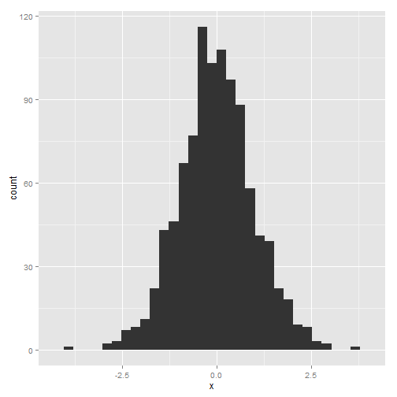

This is my first blog post. Don't you love it?


```r
library(ggplot2)
x <- rnorm(1000)

qplot(x, geom = "histogram")
```

```
## stat_bin: binwidth defaulted to range/30. Use 'binwidth = x' to adjust
## this.
```

 


Woo! **Bold important words!**

###Conclusion
Read this shiz!
